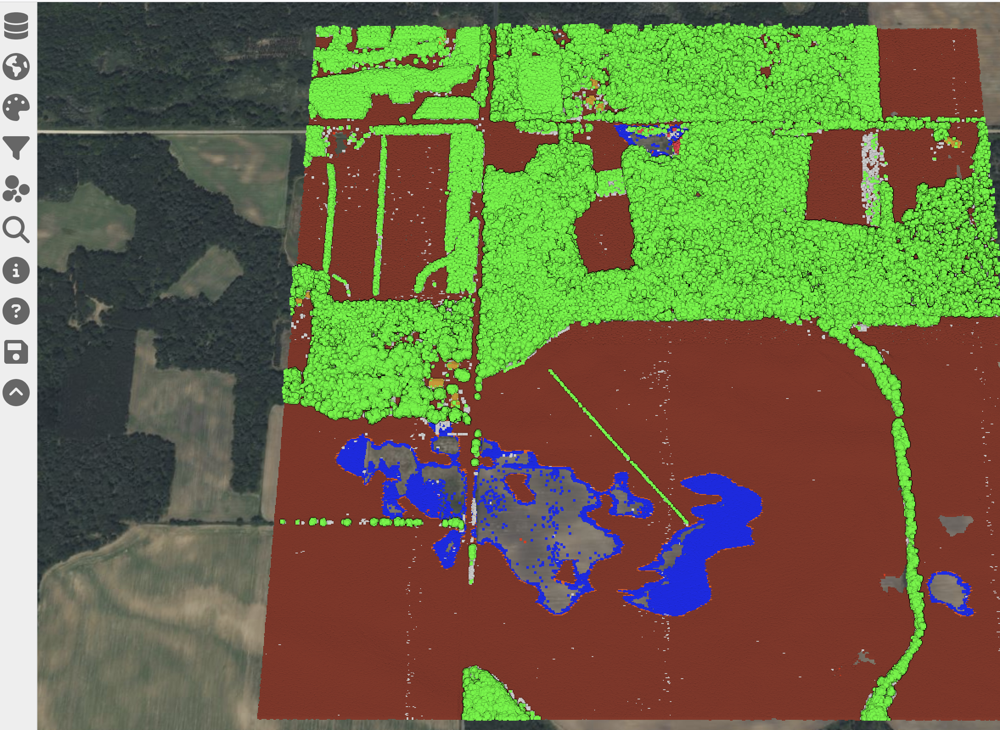
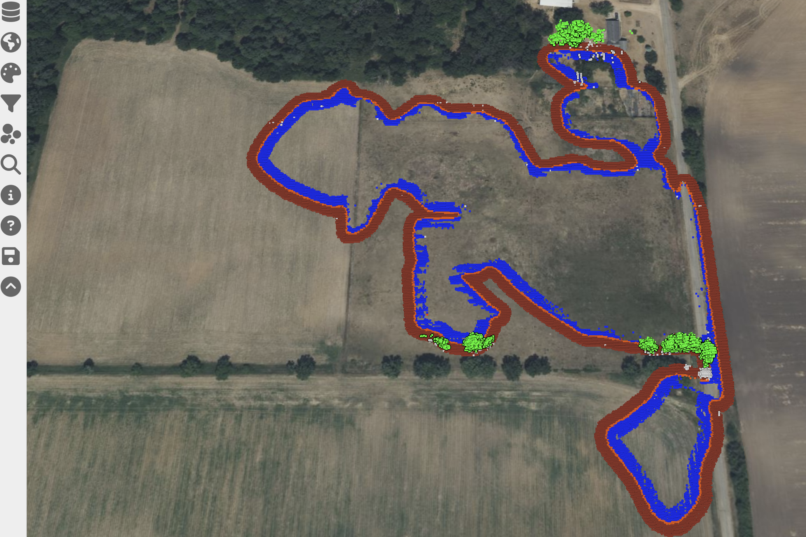
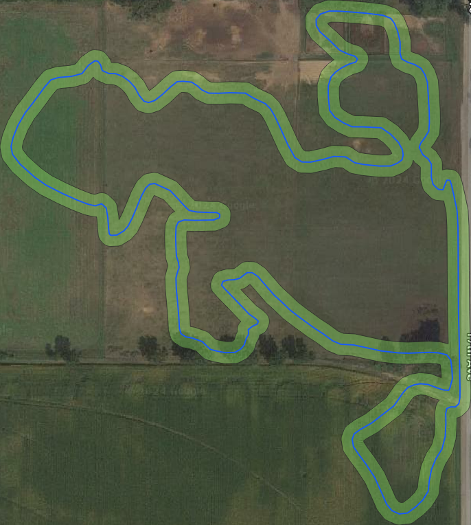
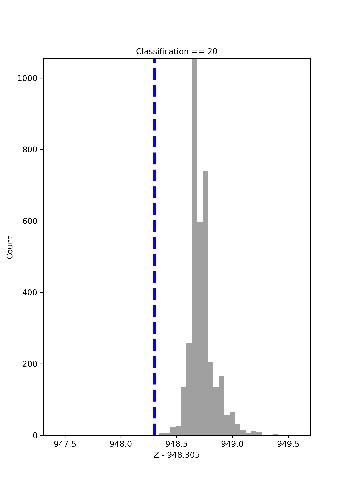

# Breakline height evaluations with PDAL

## Introduction

USGS needs to be able to verify and validate the breakline geometries provided
against point cloud data. This process has currently been a combination of
manual inspection via visualization and can be quite time consuming. The
intent of this article is to demonstrate how PDAL can be used to generate
statistics that could be used for verification of breakline geometry levels
in relation to the point clouds in the near-shore boundary. These ideas
are hopefully useful in the context of NGTOC building a process to automate the
extraction of waterbody point cloud metrics that could short-circuit a
significant portion of the manual inspection process.

## Simple algorithm description

The approach uses a couple of different ideas, but they're pretty basic GIS
concepts:

* Buffer each breakline to a given threshold (I picked 20m)
* Select points within the buffer using 2d intersection by using
  [`readers.copc`](https://pdal.io/en/latest/stages/readers.copc.html)'s `ogr`
  query block.
* Label each point within that buffer with its 2d distance to the breakline. We
  can do this by using PDAL's
  [`filters.geomdistance`](https://pdal.io/en/latest/stages/filters.geomdistance.html)
  filter, which will take each point and compute the distance-to-segment.
* Apply some simple expressions with [`filters.expression`](https://pdal.io/en/latest/stages/filters.expression.html) to select points within the buffer and plot them with matplotlib.

## Example

<a href="https://viewer.copc.io?state=7dfe03e2f18ddf44b3a6dcfac384d963d6492a3d58ffc0b71a03daa5c1d25502">

</a>

I chose `USGS_LPC_WI_Statewide_2019_A19_0344` in `WI_Adams_2019` which has a few closed-form waterbodies in it. The example waterbody that was chosen was the one on the middle left of the tile.</figcaption>

Looking at the classification values of the data (click the image for a live preview), it contains the following classification in the near-shore:

* unclassified (0)
* ground (2)
* high vegetation (6)
* noise (7)
* water (9)
* ignored ground (20)


<a href="https://viewer.copc.io?state=02e460d164c36e0a2291ee642576728a2ae958aa0e33bb5731790ab355d8cce4">
    
</a>

## Breakline Buffering

[GDAL](https://gdal.org) provides sophisticated utilities for manipulating vector geometry
on the command line. Two key features are [VRT](https://gdal.org/en/latest/drivers/vector/vrt.html) and the
GDAL [SQL dialects](https://gdal.org/en/latest/user/ogr_sql_dialect.html).

[`snake.sh`](./snake.sh) is used to prepare our waterbody geometry for interaction with
PDAL. We need to do a couple of things:

* Buffer the breakline to 20m and add an attribute called ``InBuffer`` with its
  value set to 1
* Union the breakline to a closed-form polygon.



<details>

### Usage

```
./snake.sh waterbody.geojson 20
```

The script currently assumes the data are in `EPSG:7587` due to the `WI_Adams_2019` project. This
will need to be adjusted if it matters to you.
</details>


## Pipeline

The pipeline at [`pipeline.json`](./pipeline.json) provides a full workflow for extracting the buffered
points around a breakline. Be sure to review it for detailed comments on how each filter works.

Once we have the data, we can extract some statistics from it and plot some pictures
with matplotlib.

<a href="https://viewer.copc.io?state=e029066ddb92005eb0fd79c57e5df795534589ff2386e512eac316746353d69b">
    
</a>


<details>

### Usage

```
pdal pipeline pipeline.json
```

</details>


## Matplotlib

Once we have  `usgs-breakline-eval.copc.laz` that is output by the pipeline, we can plot some simple histogram to compare the given water level of the breakline with the Z values of the points themselves.

    
</a>

<details>

### Example Usage


```
histogram.py FILENAME CLASSIFICATION_BREAK WATER_LEVEL
```

```
python histogram.py usgs-breakline-eval.copc.laz 20 948.305
```

</details>
